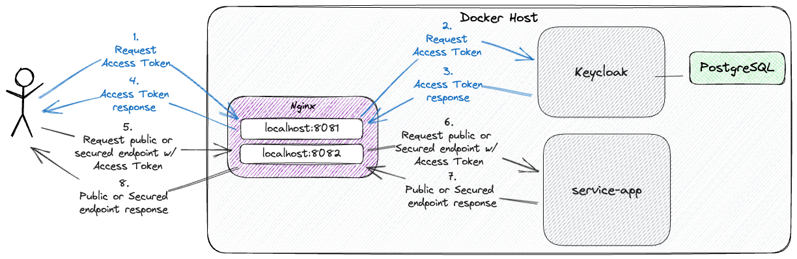

# spring-nginx-keycloak-postgres

The goal of this project is to use [`Nginx`](https://nginx.org/en/) as a reverse proxy and load balancer for a [`Keycloak`](https://www.keycloak.org/) and a [`Spring Boot`](https://docs.spring.io/spring-boot/docs/current/reference/htmlsingle/) application, called `service-app`. The `service-app` app will use `Keycloak` for IAM.

## Project Diagram



## Application

- ### service-app

  `Spring Boot` Web Java application that exposes the following endpoints:

  - `GET /api/public`: This endpoint is not secured; everybody can access it;
  - `GET /api/secured`: This endpoint is secured and can only be accessed by users who provide a `JWT` access token issued by `Keycloak`. The token must contain the role `APP_USER`.

## Prerequisites

- [`Java 17+`](https://www.oracle.com/java/technologies/downloads/#java17)
- [`Docker`](https://www.docker.com/)
- [`jq`](https://stedolan.github.io/jq)

## Building service-app Docker Image

- In a terminal, make sure you are inside the `service-app` root folder.

- Run the following :
  ```
  ./gradlew build
  ```

## Starting Environment

Open a terminal and inside the `spring-nginx-keycloak-postgres` root folder run:

```
docker-compose build && docker-compose up -d
```

This script will start:

- one `PostgreSQL` Docker container;
- one `Keycloak` Docker container;
- one `Service-app` Docker container;
- one `Nginx` Docker container;

## Configuring Keycloak

We can configure a client for `service-app` in `Keycloak` by using `Keycloak` website at http://localhost:8080. However, to keep things simple and fast, we've created a script for it.

So, in a terminal, make sure you are inside the `spring-nginx-keycloak-postgres` root folder, run the script below:

```
./init-keycloak.sh
```

The script will:

- create `company-services` realm;
- disable the required action `Verify Profile`;
- create `service-app` client;
- create the client role `APP_USER` for the `service-app` client;
- create `USERS` group;
- assign `APP_USER` client role to `USERS` group;
- create `user-test` user;
- assign `USERS` group to `user-test`;

To complete, copy the `SERVICE_APP_CLIENT_SECRET` value that is shown at the end of the script. It will be needed whenever we call `Keycloak` to get a `JWT` access token to access `service-app`.

## Testing the service-app endpoints

1. Open a new terminal;

2. Call the endpoint `GET /public`:

   ```
   curl -i http://localhost:8082/public
   ```

   It should return:

   ```
   HTTP/1.1 200
   ...
   Hi World, I am a public endpoint
   ```

3. Try to call the endpoint `GET /secured` without authentication:

   ```
   curl -i http://localhost:8082/secured
   ```

   It should return:

   ```
   HTTP/1.1 401
   ...
   ```

4. Create an environment variable that contains the `Client Secret` generated by `Keycloak` to `service-app` at [Configure Keycloak](#configuring-keycloak) step:

   ```
   SERVICE_APP_CLIENT_SECRET=...
   ```

5. Run the command below to get an access token for `user-test` user:

   ```
   USER_TEST_ACCESS_TOKEN="$(curl -s -X POST \
     "http://localhost:8081/realms/company-services/protocol/openid-connect/token" \
     -H "Content-Type: application/x-www-form-urlencoded" \
     -d "username=user-test" \
     -d "password=123" \
     -d "grant_type=password" \
     -d "client_secret=$SERVICE_APP_CLIENT_SECRET" \
     -d "client_id=service-app" | jq -r .access_token)"
   echo $USER_TEST_ACCESS_TOKEN
   ```

6. Call the endpoint `GET /secured`:

   ```
   curl -i http://localhost:8082/secured -H "Authorization: Bearer $USER_TEST_ACCESS_TOKEN"
   ```

   It should return:

   ```
   HTTP/1.1 200
   ...
   Hi user-test, I am a secured endpoint
   ```

7. The access token default expiration period is `5 minutes`. So, wait for this time and, using the same access token, try to call the secured endpoint.

   It should return:

   ```
   HTTP/1.1 401
   ...
   WWW-Authenticate: Bearer error="invalid_token", error_description="An error occurred while attempting to decode the Jwt: Jwt expired at ...", error_uri="https://tools.ietf.org/html/rfc6750#section-3.1"
   ...
   ```

## Useful Links & Commands

- **Keycloak**

  The `Keycloak` website is at http://localhost:8080

- **Service-App**
  The `Service-App` api is at http://localhost:9090

- **Nginx**
  The `Nginx` website is at http://localhost:8081 for Keycloak endpoints and http://localhost:8082 for Service-App endpoints

## Cleanup

To remove the all docker image created, simply go to a terminal and run the following script:

```
./shutdown-environment.sh
```

## Wiki

- **Keycloak**

Keycloak containers don't come with curl or wget in it, this forces the users to use alternative mechanisms to realise health checks for the keycloak standard containers.

```
      healthcheck:
      test:
        [
          "CMD-SHELL",
          "exec 3<>/dev/tcp/127.0.0.1/9000;echo -e \"GET /health/ready HTTP/1.1\r\nhost: http://localhost\r\nConnection: close\r\n\r\n\" >&3;grep \"HTTP/1.1 200 OK\" <&3",
        ]
```

The command you've provided is a Bash script that does the following:

1. **`exec 3<>/dev/tcp/127.0.0.1/9000`**: This opens a TCP connection to `127.0.0.1` (localhost) on port `9000` and assigns file descriptor 3 for both reading and writing to that connection.

2. **`echo -e "GET /health/ready HTTP/1.1\r\nhost: http://localhost\r\nConnection: close\r\n\r\n" >&3`**: This sends an HTTP `GET` request to the `/health/ready` endpoint of the server running on `127.0.0.1:9000`. The `\r\n` sequences represent carriage return and line feed, which are required to properly format the HTTP request.

3. **`grep "HTTP/1.1 200 OK" <&3`**: This reads the response from the server via the previously opened connection (file descriptor 3) and searches for the string `"HTTP/1.1 200 OK"`. This indicates that the server responded with a successful HTTP status code (200 OK).

### Summary

This script essentially checks if a server running on `localhost:9000` is healthy by making an HTTP GET request to `/health/ready`. If the server responds with `HTTP/1.1 200 OK`, it implies that the health check passed.

If the server returns anything other than `HTTP/1.1 200 OK`, the `grep` command would not return anything, indicating that the health check failed.
